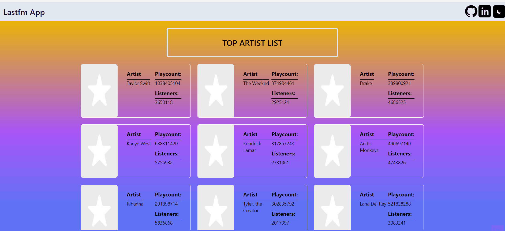
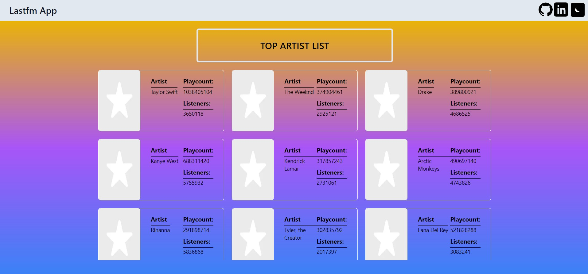

## Check The Live Website ➡️ [Live Website](https://aslinurtolga-lastfm.netlify.app/)

## LAST.FM 

#### It is an application that you can access the 'Top Artists' and their 'Top Albums' and 'Top Tracks' with the detail. I used the same component for Albums and Tracks card component. The information is taken from the Last.fm API.


```bash
🎼 User can see the list of top artists at the main page.
🎙️ User can see the detail of a specific artist.
🌓 User can switch to dark mode and vice-versa.
```
## Animation of the Website



## Visulation of the Website



## Description
Project aims get information about Last.fm via a React, Redux, Storybook and Cypress Testing.

## Problem Statement
Design a weather condition page following the design and populate data for searched city with using of axios in JS.

## Technologies 💻
```bash
- React
- React Router Dom
- Redux Toolkit
- Cypress Testing
- Tailwindcss
- Storybook
- [Last.fm API](https://www.last.fm/tr/api)
```
